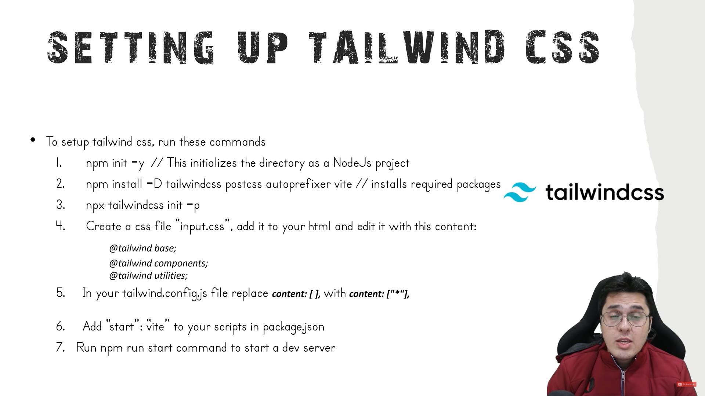

## in these i gonna use yarn
# initialize a project as node project 
```
yarn init -y
```

# using PostCSS

- so first of all we need install tailwindcss via yarn.

```
yarn add -D tailwindcss postcss autoprefixer
```

- after that we need install vite tool for it via yarn.

```
yarn add vite
```

- we need to configure in package.json file and need to write a script

```
"scripts": {
    "start": "vite"
  },
```

- after that we need start tailwind to create tailwind.config.js file
```
yarn tailwindcss init -p

``` 

# Note: using Tailwind extension is easy to implement a code.

